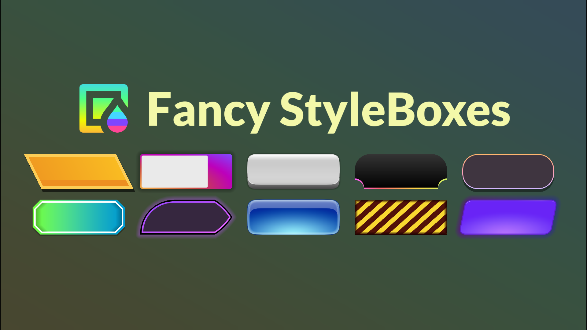
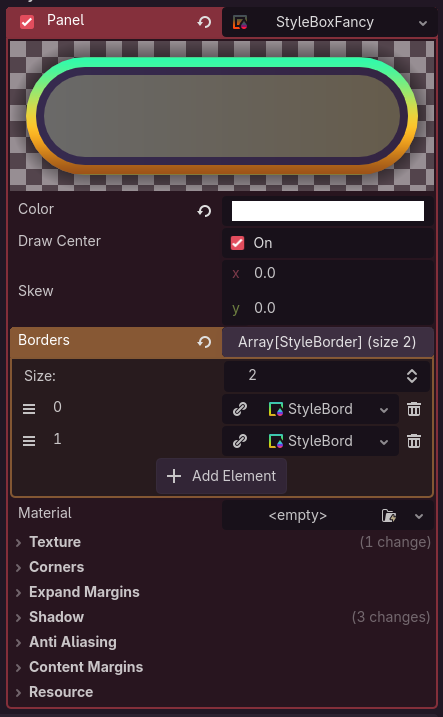
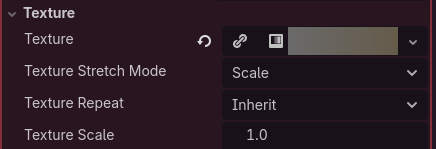
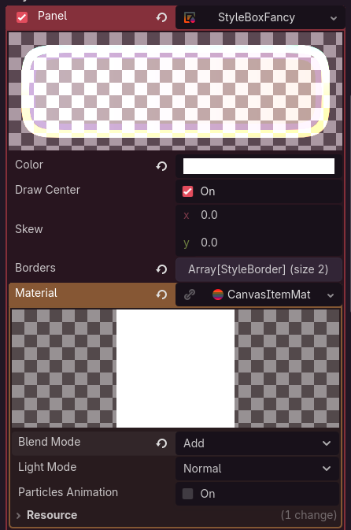
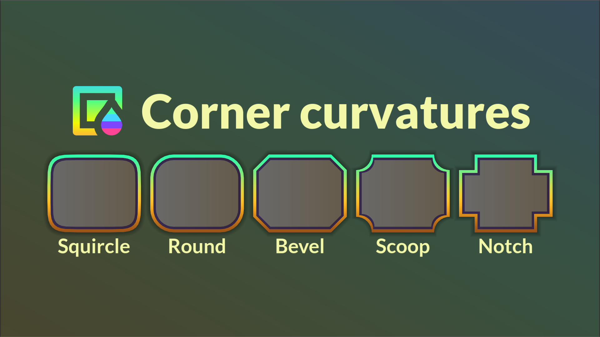
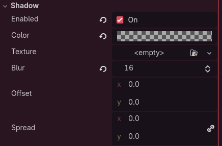
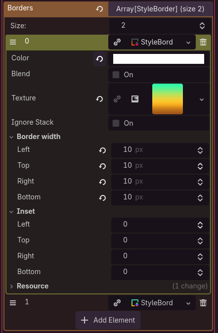

# Fancy Styleboxes
A powerful StyleBox that fills the gap between Godot's StyleBoxFlat and StyleBoxTexture by combining their features and adding more on its own.

# Why does this exist?
There were several occasions where I wanted to create panel designs that sounded quite trivial, like a gradient with rounded corners, but it was impossible to do with either `StyleBoxFlat` or `StyleBoxTexture`. I found myself having to look for alternatives, such as creating a specific texture, using shaders, creating nodes with clip children, or manually drawing my nodes. Each of these options had its drawbacks, so I created my own StyleBox seeking to expand `StyleBoxFlat` functionality to make it a much more flexible tool. 

## Main features
* Rounded panels with a background texture.
* Add a texture to a border.
* Add multiple borders.
* Use corner shapes (round, squircle, bevel, scoop, notch and everything in between).
* Apply materials (shaders) [EXPERIMENTAL]

# Requierements
The minimum Godot version required is 4.4

# Installation
## Asset library / Asset store
* In your godot project open the AssetLib / AssetStore tab and search for "Fancy StyleBoxes".
* Download and install into your addons folder.
* Enable the plugin in `Project/Project Settings/Plugins`. **(Don't forget!!)**

## Manual install
* Download the latest release [here](https://github.com/xZpookyx/StyleBoxFancy/releases).
* Inside the zip file should be an "addons" folder, uncompress it and move it to your project root folder.
* Enable the plugin in `Project/Project Settings/Plugins`. **(Don't forget!!)**

# Usage
Add a new StyleBoxFancy to a panel or button.

StyleBoxFancy comes with similar properties as StyleBoxFlat such as:
* `Color`
* `Skew`
* `Corner radius` / `Corner detail`
* `Expand margins`
* `Shadow`
* `Antialiasing`

You can also **convert** a `StyleBoxFlat` or `StyleBoxTexture` *(to a minor degree)* into a `StyleBoxFancy`.

> [!WARNING]
> Setting a StyleBoxFancy or any other custom resource in the main theme of a project might yield `Parameter "SceneTree::get_singleton()" is null` error, this is a bug from godot,
> see [this github issue](https://github.com/godotengine/godot/issues/111656)

# Features

## Texture

Allows you to apply a `Texture2D` to your panel, it is compatible with rounded corners and antialiasing. A common use for this is creating a rounded panel with a `GradientTexture2D` which is not possible using Godot's StyleBoxes.

If a texture is set its color will be modulated by the `color` property, so if you don't want to modify the texture's color then set `color` to white.

### Stretch mode
Controls the behavior of the texture when resizing the StyleBox, similar to a `TextureRect`.

### Texture repeat
Sets the repeating mode that the texture will use, this overrides the entire `CanvasItem` `texture_repeat` property, if set to `inherit` then it will use the mode that `CanvasItem`.> 

> [!NOTE]
> When setting back to Inherit from another mode, it might not update inmediately, in that case you need to set again the `CanvasItem` `texture_repeat` property.
>
> The editor stylebox preview will absolutely ignore this property and may appear different from the 2D scene.

## Material
> [!WARNING]
> This feature is **experimental** due to how StyleBoxes access the material property of the `CanvasItem` and has some caveats, shouldn't break anything but use at your own risk.

Overrides the `CanvasItem` material that uses this StyleBox. It accept `CanvasItemMaterial` and `ShaderMaterial` as valid materials.

> [!IMPORTANT]
> A texture MUST be set for both the background and borders for the UVs to work, otherwise they will all be set to (0, 0). Also UVs are affected by `texture_stretch_mode` and `texture_scale`.
>
> Removing a material will also not inmediately update all nodes using it, reload the scenes using them to update them.

## Corners

This plugin comes with its own inspector for corner editing for ease of use and compactness.
* **Linking** allows you to set all corner values at the same time.
* In the **Radius** tab clicking on the corner icons reverts their value to 0.
* In the **Curvature** tab clicking on the corner icons shows a list of presets for curvatures.

### Corner curvature

Allows you to change the corner shape based on a [superellipse](https://en.wikipedia.org/wiki/Superellipse) formula.

Different curvature values give different corner shapes:
* **1:** Round
* **2:** Squircle
* **0:** Bevel
* **-1:** Scoop
* **-2:** Reverse Squircle

Positive values make outward curves that get closer to a square at high values and negative values makes inward curves.

## Shadow

Shadow has a dedicated `enabled` property that allows using shadows with 0 `blur`.

The `spread` property will expand or shrink the shadow compared to its original panel size.

## Borders

`StyleBoxFancy` implements borders as a list of `StyleBorder` so you can have more than 1 border, each `StyleBorder` has its own properties and are drawn stacked one on top of another. It includes the same properties as `StyleBoxFlat`'s border.

### Texture
Allows you to apply a `Texture2D` to your border.

If a texture is set its color will be modulated by the `color` property, so if you don't want to modify the texture's color then set `color` to white.

### Ignore stack
By default borders will stack so each border is moved inwards, by enabling this property it will be drawn as it were the top border regardless of its position on the list, and it will not interact with other borders.

### Inset
Allows you to move each side of the border inwards leaving an empty area behind, it can also be moved outwards with a negative value.

# Performance
Compared to `StyleBoxFlat` it is about 6.5~ times slower, mainly due to it being written in GDScript and not C++

This is not a problem for most of use cases as rendering them is not expensive, only games with lots of UI or constant animations may have to consider this.

> [!NOTE]
> Tested in Godot 4.7 with 1000 panels constantly being redrawn each frame with both StyleBoxes having a border and antialiasing on, using Godot's profiler measuring Frame Time (ms).
> * StyleBoxFlat: **34.24 ms**
> * StyleBoxFancy: **222.95 ms**

